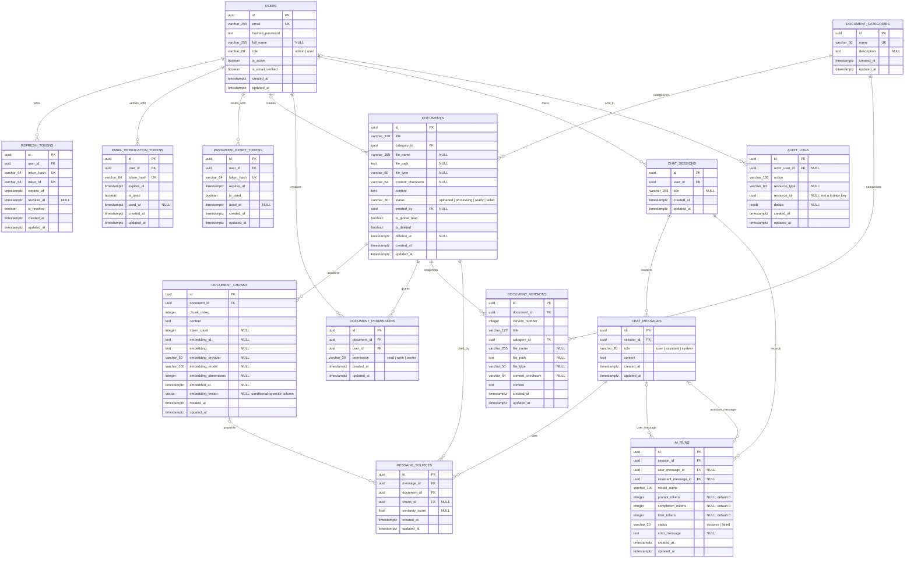

# Database ER Diagram

PostgreSQL schema `kb` (configurable), derived from Alembic head `0011_admin_documents_global_read`.

Composite unique constraints:

- `document_chunks (document_id, chunk_index)`
- `document_permissions (document_id, user_id)`
- `document_versions (document_id, version_number)`

`document_chunks.embedding_vector` and its HNSW index are created only when pgvector is available and embedding dimensions are usable.
